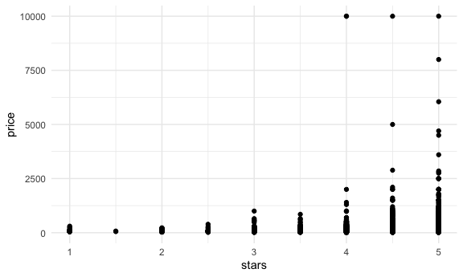
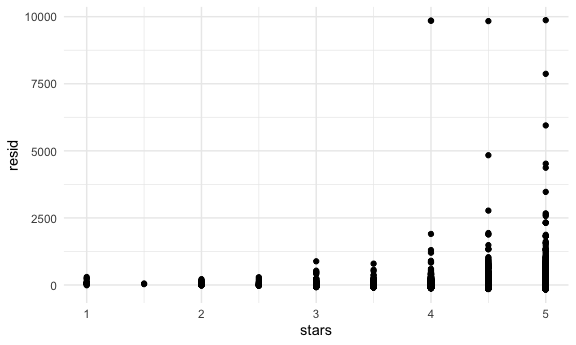
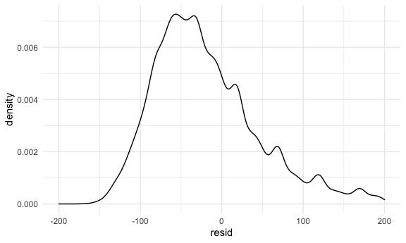
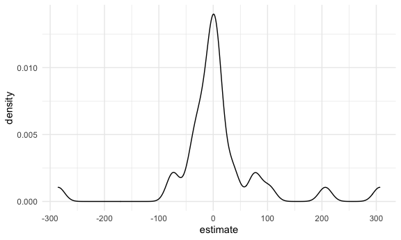
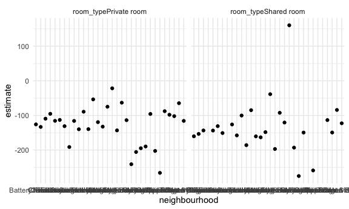

Linear Models
================
Philip Kim
11/20/2021

Load NYC Airbnb data.

``` r
data("nyc_airbnb")

nyc_airbnb = 
  nyc_airbnb %>% 
  mutate(stars = review_scores_location / 2) %>% 
  rename(
    borough = neighbourhood_group
  ) %>% 
  filter(borough != "Staten Island") %>% 
  select(price, stars, borough, neighbourhood, room_type)
```

Visualizations …

``` r
nyc_airbnb %>% 
  ggplot(aes(x = stars, y = price)) +
  geom_point()
```

    ## Warning: Removed 9962 rows containing missing values (geom_point).



Let’s fit a linear model

``` r
fit = lm(price ~ stars + borough, data = nyc_airbnb)

fit
```

    ## 
    ## Call:
    ## lm(formula = price ~ stars + borough, data = nyc_airbnb)
    ## 
    ## Coefficients:
    ##      (Intercept)             stars   boroughBrooklyn  boroughManhattan  
    ##           -70.41             31.99             40.50             90.25  
    ##    boroughQueens  
    ##            13.21

``` r
summary(fit)
```

    ## 
    ## Call:
    ## lm(formula = price ~ stars + borough, data = nyc_airbnb)
    ## 
    ## Residuals:
    ##    Min     1Q Median     3Q    Max 
    ## -169.8  -64.0  -29.0   20.2 9870.0 
    ## 
    ## Coefficients:
    ##                  Estimate Std. Error t value Pr(>|t|)    
    ## (Intercept)       -70.414     14.021  -5.022 5.14e-07 ***
    ## stars              31.990      2.527  12.657  < 2e-16 ***
    ## boroughBrooklyn    40.500      8.559   4.732 2.23e-06 ***
    ## boroughManhattan   90.254      8.567  10.534  < 2e-16 ***
    ## boroughQueens      13.206      9.065   1.457    0.145    
    ## ---
    ## Signif. codes:  0 '***' 0.001 '**' 0.01 '*' 0.05 '.' 0.1 ' ' 1
    ## 
    ## Residual standard error: 181.5 on 30525 degrees of freedom
    ##   (9962 observations deleted due to missingness)
    ## Multiple R-squared:  0.03423,    Adjusted R-squared:  0.03411 
    ## F-statistic: 270.5 on 4 and 30525 DF,  p-value: < 2.2e-16

If you want to present output

``` r
fit %>% 
  broom::tidy() %>% 
  mutate(term = str_replace(term, "borough", "Borough:")) %>% 
  select(term, estimate, p.value) %>% 
  knitr::kable(digits = 3)
```

| term              | estimate | p.value |
|:------------------|---------:|--------:|
| (Intercept)       |  -70.414 |   0.000 |
| stars             |   31.990 |   0.000 |
| Borough:Brooklyn  |   40.500 |   0.000 |
| Borough:Manhattan |   90.254 |   0.000 |
| Borough:Queens    |   13.206 |   0.145 |

## Diagnostics

``` r
modelr::add_residuals(nyc_airbnb, fit) %>% 
  ggplot(aes(x = stars, y = resid)) +
  geom_point()
```

    ## Warning: Removed 9962 rows containing missing values (geom_point).



``` r
modelr::add_residuals(nyc_airbnb, fit) %>% 
  ggplot(aes(x = resid)) +
  geom_density() +
  xlim(-200, 200)
```

    ## Warning: Removed 11208 rows containing non-finite values (stat_density).



## Interactions? Nesting?

Let’s try a different model

``` r
fit = lm(price ~ stars + room_type, data = nyc_airbnb)

broom::tidy(fit)
```

    ## # A tibble: 4 × 5
    ##   term                  estimate std.error statistic   p.value
    ##   <chr>                    <dbl>     <dbl>     <dbl>     <dbl>
    ## 1 (Intercept)               51.4     11.5       4.46 8.25e-  6
    ## 2 stars                     30.6      2.41     12.7  8.00e- 37
    ## 3 room_typePrivate room   -111.       2.05    -54.1  0        
    ## 4 room_typeShared room    -132.       6.18    -21.3  3.11e-100

Let’s try nesting

``` r
nyc_airbnb %>% 
  relocate(borough) %>% 
  nest(data = price:room_type) %>% 
  mutate(
    lm_fits = map(.x = data, ~lm(price ~ stars + room_type, data = .x)),
    lm_results = map(lm_fits, broom::tidy)
  ) %>% 
  select(borough, lm_results) %>% 
  unnest(lm_results) %>% 
  filter(term == "stars")
```

    ## # A tibble: 4 × 6
    ##   borough   term  estimate std.error statistic  p.value
    ##   <chr>     <chr>    <dbl>     <dbl>     <dbl>    <dbl>
    ## 1 Bronx     stars     4.45      3.35      1.33 1.85e- 1
    ## 2 Queens    stars     9.65      5.45      1.77 7.65e- 2
    ## 3 Brooklyn  stars    21.0       2.98      7.05 1.90e-12
    ## 4 Manhattan stars    27.1       4.59      5.91 3.45e- 9

Look at neighborhoods in Manhattan

``` r
manhattan_lm_results_df = 
nyc_airbnb %>% 
  filter(borough == "Manhattan") %>% 
  select(-borough) %>% 
  relocate(neighbourhood) %>% 
  nest(data = price:room_type) %>% 
  mutate(
    lm_fits = map(.x = data, ~lm(price ~ stars + room_type, data = .x)),
    lm_results = map(lm_fits, broom::tidy)
  ) %>% 
  select(neighbourhood, lm_results) %>% 
  unnest(lm_results)

manhattan_lm_results_df %>% 
  filter(term == "stars") %>% 
  ggplot(aes(x = estimate)) +
  geom_density()
```



``` r
manhattan_lm_results_df %>% 
  filter(str_detect(term, "room_type")) %>% 
  ggplot(aes(x = neighbourhood, y = estimate)) +
  geom_point() +
  facet_grid(~term)
```


